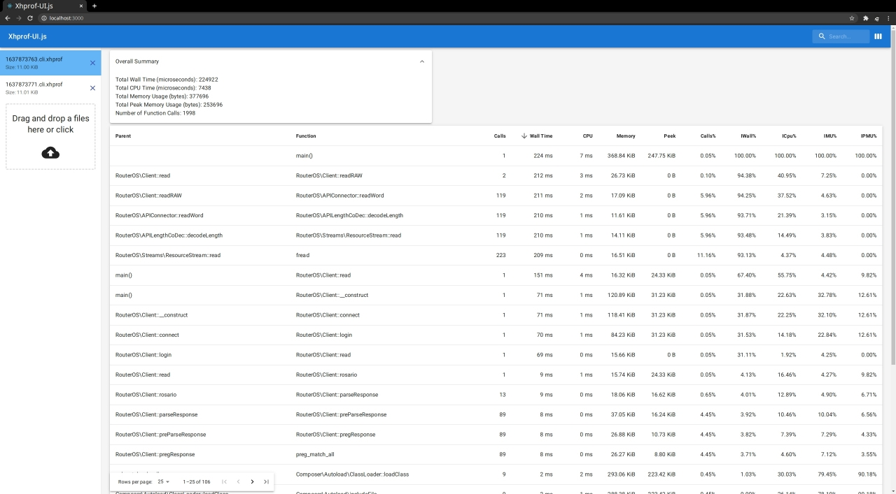

# XHProf UI JS

Modern and flexible UI for viewing XHProf dumps.



## How to use

In the project directory, you can run:

```shell
npm install
```

This command will install required packages described in
[package.json](./package.json) and [package-lock.json](./package-lock.json).

Then run the app in the development mode:

```shell
npm start
```

Open [http://localhost:3000](http://localhost:3000) to view it in the browser.

But in case if you need deployable application instead of `npm start` us this:

```shell
npm run build
```

This command build the app for production to the `build` folder.

## Other

This project was bootstrapped with [Create React App](https://github.com/facebook/create-react-app).
