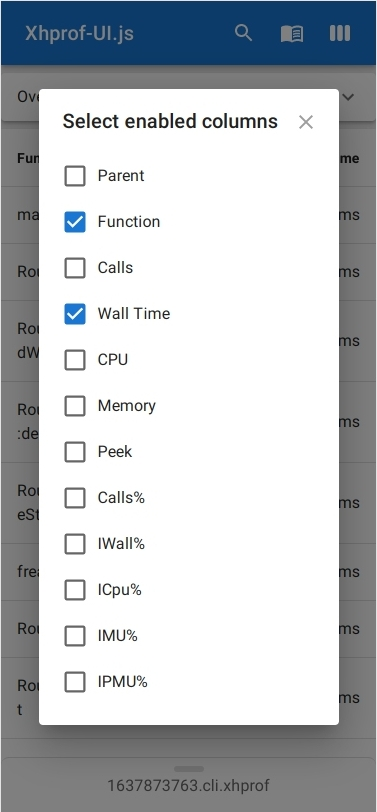

# XHProf-UI.js

Modern, flexible and Mobile friendly UI for
viewing [XHProf](https://github.com/longxinH/xhprof) dumps.

| Desktop | Mobile |
|---------|--------|
|||

## Table of Contents

* [Features](#Features)
    * [Selecting visible columns](#Selecting-visible-columns)
    * [Searching and filtering](#Searching-and-filtering)
    * [Order by column](#Order-by-column)
    * [Pagination](#Pagination)
* [How to install](#How-to-install)
* [Other](#Other)

## Features

The main idea of this application is to make it possible to read dumps
of the XHProf profiler without installing setting up a database, an
interpretator on a backend, and so on.

All you need is a browser and the XHProf's dump files.

Because IT "things" should be as simple as possible!

Plus, the existing systems for viewing XHProf files do not support
mobile devices, but of course, you may open legacy XHProf UI or LiveProf
or any other systems on mobile, but the UI will cause a headache because
these systems are optimized only for desktops. But sometimes you really 
want to download a dump file from the Slack and just quickly watch it on 
your mobile phone :)

### Selecting visible columns

Sometimes you need just check Wall Time in combination with amount of
function Calls, on exists XHProf viewers you can't turn off not required
columns, but this app support this feature.

| Desktop | Mobile |
|---------|--------|
|||

### Searching and filtering

If you need a filter by function just click on the required function,
if you don't know the full name of a function, then you may find it via
search.

| Desktop | Mobile |
|---------|--------|
|||

### Order by column

The application may order XHProf results in ASC and DESC order,
just click to column on table header.

### Pagination

On left bottom side of the application you may find pagination component.

## How to install

Clone the repo, then in the project directory you can run:

```shell
npm install
```

This command will install required packages described in
[package.json](./package.json) and [package-lock.json](./package-lock.json).

Then run the app in the development mode:

```shell
npm start
```

Open [http://localhost:3000](http://localhost:3000) to view it in the browser.

But in case if you need deployable application instead of `npm start` us this:

```shell
npm run build
```

This command build the app for production to the `build` folder.

## Other

This application created using following technologies:

* [React](https://reactjs.org/)
* [Redux](https://redux.js.org/)
* [Material UI](https://mui.com/)
